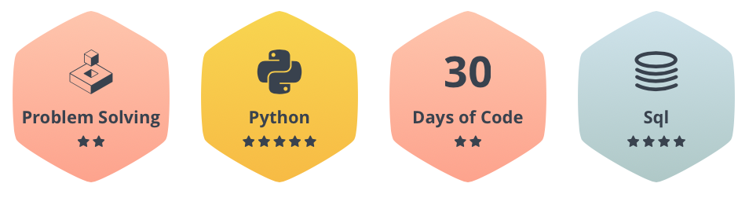

# hackerrank
Archive of [HackerRank](https://www.hackerrank.com/yyyzzz10104) challenges. 

## Badges

* Python: 24 tasks completed
* SQL: 37 tasks completed

## Python

* [itertools.permutations()](https://www.hackerrank.com/challenges/itertools-permutations/problem)
  * [code](./itertools_permutations.py)
* [itertools.product()](https://www.hackerrank.com/challenges/itertools-product/problem)
  * [code](./itertools_product.py)
* [Capitalize!](https://www.hackerrank.com/challenges/capitalize/problem)
  * [code](./Capitalize.py)
* [String Validators](https://www.hackerrank.com/challenges/string-validators/problem)
  * [code](./String_Validators.py)
* [Find a string](https://www.hackerrank.com/challenges/find-a-string/problem)
  * [code](./Find_a_string.py)
* [Mutations](https://www.hackerrank.com/challenges/python-mutations/problem)
  * [code](./Mutations.py)
* [String Split and Join](https://www.hackerrank.com/challenges/python-string-split-and-join/problem)
  * [code](./String_Split_and_Join.py)
* [sWAP cASE](https://www.hackerrank.com/challenges/swap-case/problem)
  * [code](./sWAP_cASE.py)
* [Finding the percentage](https://www.hackerrank.com/challenges/finding-the-percentage/problem)
  * [code](./Finding_the_percentage.py)
* [Zipped!](https://www.hackerrank.com/challenges/zipped/problem)
  * [code](./Zipped.py)
* [Transpose and Flatten](https://www.hackerrank.com/challenges/np-transpose-and-flatten/problem)
  * [code](./Transpose_and_Flatten.py)
* [Input()](https://www.hackerrank.com/challenges/input/problem)
  * [code](./Input.py)
* [Any or All](https://www.hackerrank.com/challenges/any-or-all/problem)
  * [code](./Any_or_All.py)
* [Find the Runner-Up Score!](https://www.hackerrank.com/challenges/find-second-maximum-number-in-a-list/problem)
  * [code](./Find_the_Runner-Up_Score.py)
* [Shape and Reshape](https://www.hackerrank.com/challenges/np-shape-reshape/problem)
  * [code](./Shape_and_Reshape.py)
* [Arrays](https://www.hackerrank.com/challenges/np-arrays/problem)
  * [code](./Arrays.py)
* [Print Function](https://www.hackerrank.com/challenges/python-print/problem)
  * [code](./Print_Function.py)
* [Python If-Else](https://www.hackerrank.com/challenges/py-if-else/problem)
  * [code](./Python_If-Else.py)
  
  
## SQL

* [Top Earners](https://www.hackerrank.com/challenges/earnings-of-employees/problem)
  * [code](./Top_Earners.sql)
* [Average Population of Each Continent](https://www.hackerrank.com/challenges/average-population-of-each-continent/problem)
  * [code](./Average_Population_of_Each_Continent.sql)
* [Asian Population](https://www.hackerrank.com/challenges/asian-population/problem)
  * [code](./Asian_Population.sql)
* [Weather Observation Station 18](https://www.hackerrank.com/challenges/weather-observation-station-18/problem)
  * [code](./Weather_Observation_Station_18.sql)
* [Weather Observation Station 15](https://www.hackerrank.com/challenges/weather-observation-station-15/problem)
  * [code](./Weather_Observation_Station_15.sql)
* [Weather Observation Station 2](https://www.hackerrank.com/challenges/weather-observation-station-2/problem)
  * [code](./Weather_Observation_Station_2.sql)
* [Average Population](https://www.hackerrank.com/challenges/average-population/problem)
  * [code](./Average_Population.sql)
* [Employee Salaries](https://www.hackerrank.com/challenges/salary-of-employees/problem)
  * [code](./Employee_Salaries.sql)
* [Higher Than 75 Marks](https://www.hackerrank.com/challenges/more-than-75-marks/problem)
  * [code](./Higher_Than_75_Marks.sql)
* [Weather Observation Station 8](https://www.hackerrank.com/challenges/weather-observation-station-8/problem)
  * [code](./Weather_Observation_Station_8.sql)
* [Weather Observation Station 6](https://www.hackerrank.com/challenges/weather-observation-station-6/problem)
  * [code](./Weather_Observation_Station_6.sql)
* [Weather Observation Station 5](https://www.hackerrank.com/challenges/weather-observation-station-5/problem)
  * [code](./Weather_Observation_Station_5.sql)
* [Weather Observation Station 4](https://www.hackerrank.com/challenges/weather-observation-station-4/problem)
  * [code](./Weather_Observation_Station_4.sql)
* [Weather Observation Station 3](https://www.hackerrank.com/challenges/weather-observation-station-3/problem)
  * [code](./Weather_Observation_Station_3.sql)
* [Revising the Select Query II]()
  * [code](./Revising_the_Select_Query_II.sql)
* [Revising the Select Query I](https://www.hackerrank.com/challenges/revising-the-select-query/problem)
  * [code](./Revising_the_Select_Query_I.sql)
